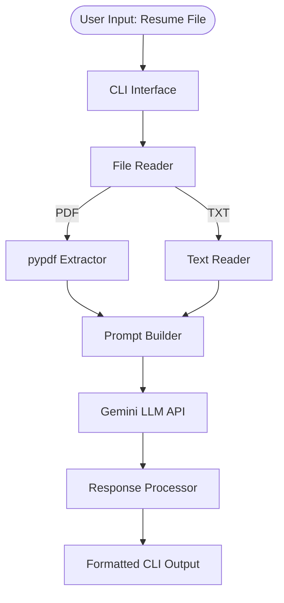

# 🧠 AI Resume Analyzer Using Gemini & Python

An intelligent CLI tool that automatically analyzes and rewrites resumes using **Google Gemini**, structured prompt engineering, and PDF parsing. Built for beginners learning AI integration and practical LLM applications.

## ✨ What It Does

- Reads resume content from **PDF or plain text** files automatically
- Generates a **professional rewrite** with stronger action verbs and structure
- Identifies **key strengths**, weak language, and missing context
- Performs an **ATS compatibility audit** for applicant tracking systems
- Demonstrates **role-based prompting** and structured prompt design
- Handles errors gracefully across file, parsing, and API failures

## 🏗️ Architecture



## 🔍 Analysis Sections

**1. Key Strengths** — Standout achievements, technical skills, and quantifiable impact statements.

**2. Improvement Areas** — Weak language, passive voice, and missing context flagged with suggestions.

**3. ATS Compatibility** — Keyword density, formatting checks, and standard header recommendations.

**4. Professional Rewrite** — A fully improved version of the resume with best practices applied automatically.


## 🧪 Prompt Engineering Techniques

**Role-based system instructions** — Positions the model as an expert resume assistant before any content is sent.

```python
system_instructions = (
    "You are an expert resume writing assistant. "
    "Please analyze the following resume:"
)
```

**Structured prompting with numbered requirements** — Produces organized, consistent output sections.

```python
user_prompt = f"""
Improve the following resume professionally.

Also provide:
1. Key strengths and skills highlighted in the resume.
2. Areas for improvement in terms of content, structure, and formatting.
3. ATS compatibility analysis and suggestions.

Resume content:
{content}
"""
```

**Context injection** — Resume content is dynamically embedded into a reusable prompt template.

**Temperature control** — Uses `temperature=1.0` for creative, diverse phrasing in rewrites.


## 💻 Tech Stack

| Layer | Tool |
|---|---|
| LLM | Google Gemini API |
| PDF Parsing | `pypdf` |
| CLI Interface | Python `argparse` |
| Config | `python-dotenv` |
| Error Handling | Native Python exceptions |


## 📂 Project Structure

```
resume_analyzer/
├── .env                  # API credentials (not committed)
├── requirements.txt
├── data/
│   └── My_Resume.pdf     # Place your resume here
└── analyzer.py           # Main script (file reader, prompt builder, output)
```

## 📄 Sample Output

```
--- Welcome to your AI Resume Analyzer! ---

Analyzing resume from file: data/My_Resume.pdf
Creating Gen AI client...
Analyzing resume... Please wait.

------------------------------------------------------------

REWRITTEN RESUME

Christa Frank · Senior Machine Learning Engineer
Chicago, IL | 202-555-0120

PROFESSIONAL SUMMARY
Innovative ML Engineer with 4+ years in NLP and Conversational AI...

ANALYSIS & FEEDBACK

1. Key Strengths
   - Specialization in Conversational AI
   - Full-Stack ML Capability
   - Strong Toolset with TensorFlow and Keras

2. Areas for Improvement
   - Add quantifiable achievements
   - Rewrite summary as a value proposition

3. ATS Compatibility
   - Rich in high-value keywords
   - Use a clean single-column layout
   - Save and submit as a searchable PDF

------------------------------------------------------------
```
